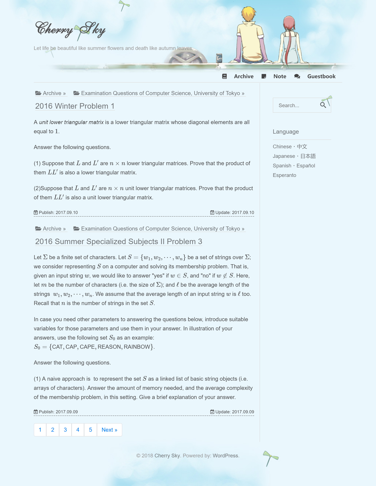

# Cherry Sky

A WordPress Theme for My Own Self-hosted Site

## Features

- [X] font awesome support (also required by **cherrysky-markdown**)
- [X] Bootstrap 4 support (also required by **cherrysky-markdown**)
- [X] MathJax support
- [X] highlight.js + line number plugin
- [X] pseudocode.js for rendering algorithms like LaTeX
- [X] tocbot for generating table of contents
- [X] a console like component
- [X] mermaid support (*remove?*)
- [X] page templates for homepage
- [X] display page inheritance
- [X] endpoint for remote access to posts list and abstract 
- [X] FiraCode font (monospaced font with programming ligatures) support
- [X] GentiumPlus font for IPA
- [X] Different fonts for different languages (HTML `lang` attribute)
  - zh-hans-cn (Simplified Chinese)
  - zh-hant-cn (Traditional Chinese)
  - ja-jp (Japanese)
  - en-us (English)
  - es-es (Spanish)
  - eo (Esperanto)
- [X] sub-domain keep in cookie (might be useful for auto redirection)
- [ ] page of settings
- [ ] widget for reference links to other languages